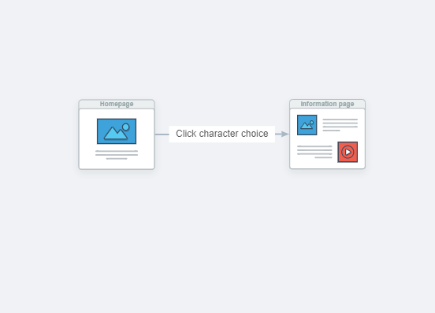

# Marvel Characters Directory

## Description

Users can search a Marvel character using a drop-down list to see information about them as well as movies they have been in and the rating of those movies.

The first set of data from Marvel API shows the character image, their name, a synopsis of their character, and the first five series of comics the character appeared in.

The second set of data from OMDb API shows the poster image of the movie associated with that character in the code, the name of the movie, the summary of the movie, and three ratings from the OMDb database: from IMDb, Rotten Tomatoes, and Metacritic.

This project was excellent for learning how to utilize github and using branches to avoid merge conflicts. It was also the first time we were really forced to learn and complete something as part of a team from our own ideas.

There are many changes we would have liked to have made, but they ultimately became stretch goals. It was good practice for keeping things simple and making sure you do not over-reach when initially developing the application, and using agile development.

### Deployed Website

[Deployed Website](https://leviathan902.github.io/Marvel-Character-Movie-Selector/)

## User Story

* As a fan, I want to know more about Marvel characters, both heroes and villains, and see what movies were made about those characters so that I can have a better understanding of the franchise and the Marvel Universe.

* Will be using Online Movie Database (OMDb) API and Marvel API.

## Elevator Pitch

This application was made to provide a single point of reference where you can get information for your favorite Marvel character instead of going to over five different websites.

## Requirements

Use a CSS framework other than Bootstrap.

    * We used Materialize

Be deployed to GitHub Pages.

Be interactive (i.e., accept and respond to user input).

    * Users choose a character from a dropdown list and the website searches by that character

Use at least two server-side APIs.

    * Marvel API

    * Online Movie Database (OMDb) API

Does not use alerts, confirms, or prompts (use modals).

    * We used a dropdown in a form to get the needed information

Use client-side storage to store persistent data.
Be responsive.

    * There is a button to save a character to a list that saves to local storage
    
    * There is a button that shows the saved characters list on screen

Have a polished UI.

Have a clean repository that meets quality coding standards (file structure, naming conventions, follows best practices for class/id naming conventions, indentation, quality comments, etc.).

Have a quality README (with unique name, description, technologies used, screenshot, and link to deployed application).

## Wireframe

## User Flow Diagram

## Screenshots

## Credits

Assignment is part of the SMU Coding Boot Camp

## License

Copyright (c) 2021 Ashley Wright, Levi Hickman, and Julio Casablanca

Covered by the [GNU General Public License v3.0](https://choosealicense.com/licenses/gpl-3.0/)